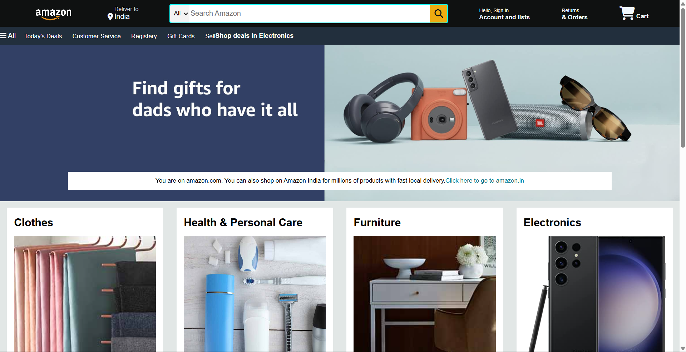
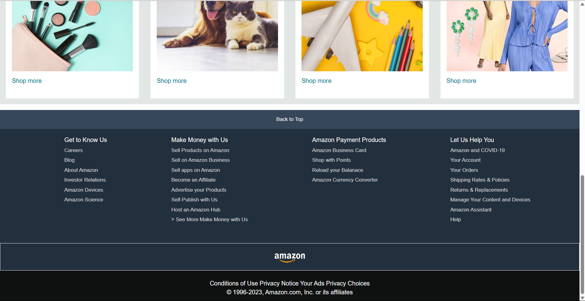

# Amazon Shopping App 

A clone of the Amazon shopping app built using HTML, CSS, and JavaScript.

[Live Demo](https://amazon-shopping-app-html-css.netlify.app/)

---

## Overview
This project replicates the UI and features of the Amazon shopping app, focusing on:
- Clean and responsive design.
- Modern layout to showcase products.
- Interactive shopping cart functionality.

---

## Features
- **Product Showcase:** Displays a variety of products with images and details.
- **Interactive Shopping Cart:** Add or remove items dynamically.
- **Responsive Design:** Optimized for desktops, tablets, and mobile devices.
- **Simple Navigation:** Easy-to-use interface for browsing products.

---

## Screenshots



---

## Technologies Used

### Frontend
- **HTML5:** Structured content.
- **CSS3:** Styling and responsive design.
- **JavaScript:** Dynamic functionality and interactivity.

### Hosting
- Hosted on Netlify: [Live Demo](https://amazon-shopping-app-html-css.netlify.app/)

---

## Installation

### Steps
1. Clone the repository:
   ```bash
   git clone https://github.com/your-username/amazon-shopping-app-clone.git
   ```

2. Navigate to the project directory:
   ```bash
   cd amazon-shopping-app-clone
   ```

3. Open the `index.html` file in your browser:
   ```bash
   open index.html
   ```

---

## How It Works
1. **Product Display:** Browse products listed with images and descriptions.
2. **Add to Cart:** Select items to add them to the shopping cart.
3. **Dynamic Updates:** JavaScript dynamically updates the cart and totals.

---

## Future Improvements
- Add user authentication for personalized shopping experiences.
- Implement backend integration for storing user data.
- Add payment gateway integration for a complete e-commerce experience.

---

## Contribution
Contributions are welcome! Feel free to fork the repository and submit a pull request.

---

## Contact
For queries or feedback, please contact [Shubham](mailto:shubhamjaishu@gmail.com).
